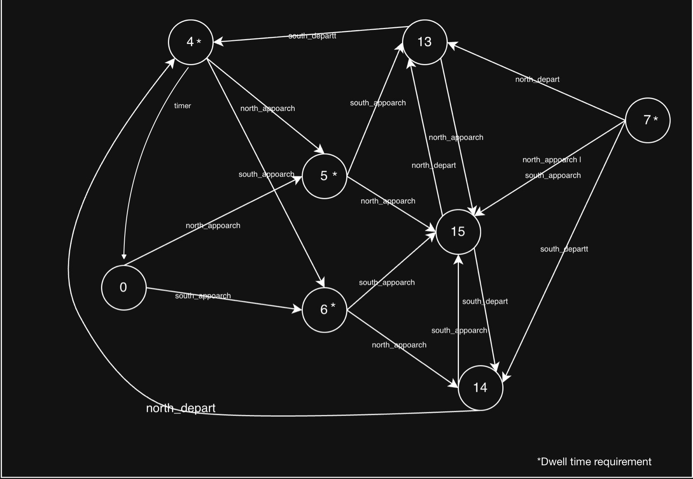

# FSM
## Invariants
1. Approach signal precede depart signal
2. The power never interrupted
3. Trains only run on each track in one direction
4. System timer is consistent
5. Alarm always on while train present
6. Saftey hazards always trigger alarms and arms, assume both trains present (* or safe state)
7. Train cannot depart w/o being present
8. Sensors don't break
9. If arms are down, alarm is on
10. Alarm off while train not present

| number | arms_down | alarm_on | northbound_present | southbound_present | north_approach | south_approach | north_depart | south_depart | timer | safety_hazard |
|--------|-----------|----------|--------------------|--------------------|----------------|----------------|--------------|--------------|---------|---------------|
| 0      | 0         | 0        | 0                  | 0                  | 6              | 5              | X            | X            |         |               |
| 1      | 0         | 0        | 0                  | 1                  | *              | *              | *            | *            |         | 5             |
| 2      | 0         | 0        | 1                  | 0                  | *              | *              | *            | *            |         | 5             |
| 3      | 0         | 0        | 1                  | 1                  | *              | *              | *            | *            |         | 5             |
| 4      | 0         | 1        | 0                  | 0                  | 6              | 5              | X            | X            | 0       |               | &larr Should go to 0, if no app
| 5      | 0         | 1        | 0                  | 1                  | 15             | 13             | X            | X            |         |               | &larr Last 2 shouldn't happen
| 6      | 0         | 1        | 1                  | 0                  | 14             | 15             | X            | X            |         |               |       Should trigger arm first
| 7      | 0         | 1        | 1                  | 1                  | 15             | 15             | 13?          | 14?          |         |               |
| 8      | 1         | 0        | 0                  | 0                  | *              | 8              | *            | *            |         | 9             | &larr; Not really a safety
| 9      | 1         | 0        | 0                  | 1                  | *              | *              | *            | *            |         | 9             |       hazard, but all 4     
| 10     | 1         | 0        | 1                  | 0                  | *              | *              | *            | *            |         | 9             |       violate #9
| 11     | 1         | 0        | 1                  | 1                  | *              | *              | *            | *            |         | 9             |
| 12     | 1         | 1        | 0                  | 0                  | X              | X              | X            | X            |         |               |
| 13     | 1         | 1        | 0                  | 1                  | 15             | 13             | X            | 4            |         |               |
| 14     | 1         | 1        | 1                  | 0                  | 14             | 15             | 4            | X            |         |               |
| 15     | 1         | 1        | 1                  | 1                  | 15             | 15             | 13           | 14           |         |               |

### Note
Our FSM design aims to strictly follow the table given in the lab brief. The `timer`/`time_elapsed`/`alarm` column doesn't work well in this context since it doesn't drive any of the branching state transition logic, only timing. The exception to this is the state 4 &rarr; 0 transition. Our diagram treats the alarm duration as an external dwell time requirement and marks the applicable states with an '\*'. These states *could* be modeled with repeating arrows and adding 'and timer' exit conditions. We felt this helped keep the diagram simple and better adapted the transition logic from the table. Additionally, we would like to note that this method & FSM would *not* work in the real world. Modeling this situation as a state transition table / traditional FSM leaves no way to account for multiple trains arriving or departing in the same direction. An extended FSM with a `train_count` variable would be much better suited.
